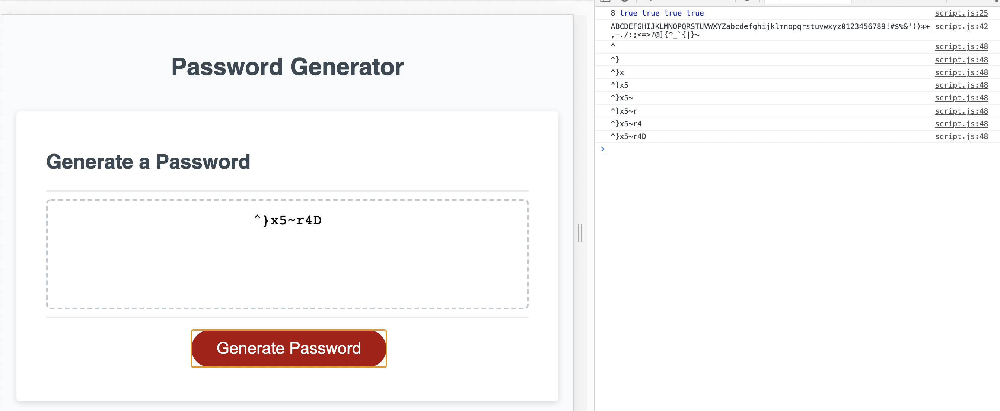

# Password Generator

## Description

By clicking the link below(deployed site) you will be taken to a Password Generator.  I started with the base code files provided by ***Trilogy Education Services*** through our lessons.  I then built off that code with my own rendition on building a randomized password generator.  Bookmark the site if you'd like for future use when you just can't seem to come up with the characters to fit a certain passwords parameters!


## Acceptance Criteria
```
GIVEN I need a new, secure password
WHEN I click the button to generate a password
THEN I am presented with a series of prompts for password criteria
WHEN prompted for password criteria
THEN I select which criteria to include in the password
WHEN prompted for the length of the password
THEN I choose a length of at least 8 characters and no more than 128 characters
WHEN prompted for character types to include in the password
THEN I choose lowercase, uppercase, numeric, and/or special characters
WHEN I answer each prompt
THEN my input should be validated and at least one character type should be selected
WHEN all prompts are answered
THEN a password is generated that matches the selected criteria
WHEN the password is generated
THEN the password is either displayed in an alert or written to the page
```

## Links to Deployed Site and GitHub Repo

[Password-Generator](https://hurleysquared.github.io/password-generator/)

[GitHub Repo](https://github.com/HurleySquared/password-generator)

## Screenshot of Password Generator


